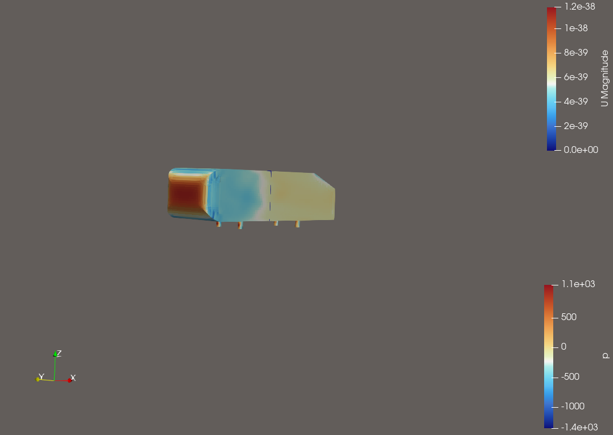

# F1 Aerodynamics & CFD Portfolio
**Author:** Ante Šimić | **Role:** Engineering Physicist & DevOps Engineer

## Overview
This repository documents my work in Computational Fluid Dynamics (CFD) using **OpenFOAM**, with a focus on motorsport aerodynamics. As an engineer with a background in **Physics** and **DevOps**, my goal is to build **automated and scalable workflows** that accelerate the aerodynamic design cycle.

## Featured Results

### 1. Ahmed Body Validation (Baseline)
Successful simulation of the standard automotive benchmark body at 40 m/s.
*   **Solver:** OpenFOAM v13 (`foamRun` / `incompressibleFluid`)
*   **Turbulence Model:** k-Omega SST
*   **Mesh:** ~240k cells with `snappyHexMesh`

*(Fig 1. Velocity magnitude slice showing flow acceleration over the roof and recirculation behind the slant)*

### 2. Heated Pipe Conjugate Heat Transfer (CHT)
**Automated validation of fluid-solid thermal coupling ($Re \approx 40,000$).**
*   **Solver:** `chtMultiRegionFoam` (Transient PIMPLE)
*   **Physics:** Coupled Thermodynamics + Turbulence ($k-\omega$ SST)
*   **Automation:** Python-driven parametric sweeps and validation
*   **Result:** <11% deviation from Dittus-Boelter correlation

*(Fig 1. Developed velocity profile in a heated pipe with coupled heat transfer)*

---

## Project Roadmap

### 1. Ahmed Body Validation Study (COMPLETED)
**Objective:** Validate OpenFOAM settings against standard wind tunnel experimental data.
- **Workflow:** Automated mesh generation and solver execution via Bash scripts.
- **Physics:** Steady-state RANS simulation matching Re = 4.3M.
- **Outcome:** Validated workflow for geometry preparation (`surfaceFeatures`), meshing, and solution.

### 2. Automated Parametric Wing Analysis (NEXT STEP)
**Objective:** Demonstrate Python automation for CFD batch processing.
- **Goal:** Eliminate manual case setup for routine parameter sweeps.
- **Toolchain:** Python + Bash + OpenFOAM.
- **Workflow:**
    1. Python script modifies Angle of Attack (AoA).
    2. Automatically generates mesh and executes solver.
    3. Extracts Lift (Cl) and Drag (Cd) coefficients.
    4. Plots L/D polar curves automatically.

### 3. Front Wing Ground Effect Study (Planned)
**Objective:** Analyze the sensitivity of front wing downforce to ride height changes.
- **Focus:** Simulating the "ground effect" phenomenon critical to F1 performance.
- **Test Matrix:** Ride heights of 20mm, 40mm, 60mm, 80mm.
- **Post-Processing:** Visualization of pressure distribution and wing tip vortices using ParaView.

### 4. Heated Pipe CHT Benchmark (COMPLETED)
**Objective:** Validate multi-region heat transfer and demonstrate "Infrastructure as Code" for CFD.
-   **Workflow:** Full Python automation for meshing, solving, and data validation.
-   **Physics:** Conjugate Heat Transfer (Fluid-Solid coupling) with wall functions.
-   **Outcome:** Validated against theoretical benchmarks ($Nu$ vs $Re$) with automated reporting.

---
*This portfolio is actively updated. Code and case files are organized by project directory.*
