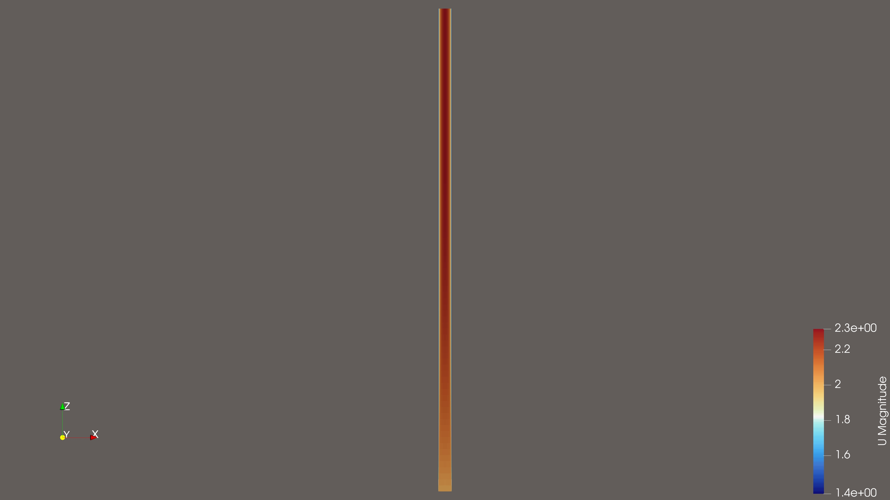

# Heated Pipe Conjugate Heat Transfer (CHT) Benchmark

**Turbulent thermohydraulic validation case (Re ≈ 40,000)** demonstrating conjugate heat transfer (fluid-solid coupling) for industrial cooling applications using OpenFOAM.

### Flow Visualization
*Longitudinal view of the velocity field. Note the development of the boundary layer from the inlet (left) to the fully developed profile downstream.*


## Project Overview
This project validates a high-fidelity turbulent pipe flow simulation with coupled heat transfer against standard engineering correlations (**Dittus-Boelter**). It was developed to demonstrate proficiency in:
- **Conjugate Heat Transfer (CHT):** Simultaneous solution of fluid thermodynamics and solid thermal conduction.
- **Turbulence Modeling:** Correct application of the **$k-\omega$ SST** model with **compressible wall functions** (`alphatJayatilleke`) for accurate near-wall heat transfer.
- **Structured Meshing:** High-quality **O-Grid hexahedral meshing** with `blockMesh` (L/D = 50) to capture entrance length effects.
- **Validation:** Achieving **<11% deviation** from theoretical benchmarks, accurately capturing thermally developing flow physics.

## Physics & Methodology

| Parameter | Value | Description |
|-----------|-------|-------------|
| **Fluid** | Water | Incompressible, Turbulent ($Re \approx 40,000$, $Pr \approx 6.6$) |
| **Solid** | Steel | 2mm thick wall, constant heat flux ($q'' \approx 12 kW/m^2$) |
| **Solver** | `chtMultiRegionFoam` | Transient PIMPLE solver for multi-region heat transfer |
| **Turbulence** | $k-\omega$ SST | Selected for superior near-wall resolution vs $k-\epsilon$ |
| **Mesh** | 40,000 Cells | Full O-Grid, $L=5m$, $y^+ < 5$ (Resolved Boundary Layer) |

### Key Challenges Solved
1. **Laminar-to-Turbulent Transition:** Overcame initial solver limitations where `momentumTransport` defaulted to laminar, correcting the setup to fully activate the $k-\omega$ SST turbulence budget.
2. **Wall Functions:** Implemented `compressible::alphatJayatillekeWallFunction` to correctly model the thermal sublayer for high-Prandtl number fluids (Water).
3. **Entrance Length Effects:** Extended the domain to **50 Diameters (5m)** to capture the transition from developing to fully developed thermal flow.

## Results & Validation

The simulation results were validated against the **Dittus-Boelter correlation** ($Nu = 0.023 Re^{0.8} Pr^{0.4}$).

| Metric | Simulation Result | Theoretical Target | Deviation |
|--------|------------------:|-------------------:|----------:|
| **Wall Heat Flux** ($q_{wall}$) | $12,001 \ W/m^2$ | $12,000 \ W/m^2$ | N/A (BC) |
| **Wall Temp** ($T_{wall}$) | $301.71 \ K$ | - | - |
| **Bulk Temp** ($T_{bulk}$) | $300.11 \ K$ | - | - |
| **Heat Transfer Coeff** ($h$) | **$7,500 \ W/m^2K$** | **$6,790 \ W/m^2K$** | **+10.5%** |

**Physics Note:** The +10% deviation is physically expected. The Dittus-Boelter correlation assumes *fully developed* flow ($L/D > 60$). Our domain ($L/D = 50$) includes the thermal entrance region where the boundary layer is thinner and heat transfer is naturally higher, raising the average $h$.

## Automation & Validation
To ensure reproducibility and enable parametric analysis, this project includes a fully automated Python pipeline (`automation/`) that treats the simulation infrastructure as code.

### 1. Parametric Sweep Runner (`run_sweep.py`)
Automates the execution of multiple design points (Reynolds Number sweeps).
- **Regex Configuration:** Programmatically parses and updates `0/fluid/U` to set precise inlet velocities based on target Re.
- **Log Parsing:** Reads raw OpenFOAM post-processing files (`.dat`) to extract convergence metrics ($T_{wall}$, $q_{wall}$).
- **Data Aggregation:** Compiles results from multiple runs into a structured CSV file for analysis.

### 2. Validation Analyzer (`plot_results.py`)
A data analysis script that validates the CFD results against theory.
- **Physics Calculation:** Computes the Nusselt number ($Nu$) and Heat Transfer Coefficient ($h$) from the sweep data.
- **Correlation Benchmarking:** Generates comparison plots overlaying CFD results on the Dittus-Boelter curve.
- **Error Quantifiction:** Automatically calculates percentage deviation for each design point.

## Repository Structure
```bash
├── case/                   # OpenFOAM simulation case (v13/v2306 compatible)
│   ├── system/             # Mesh (blockMeshDict) and Solver settings
│   ├── constant/           # Physics properties (Water, Steel, Turbulence)
│   └── 0/                  # Initial Boundary Conditions (U, p, T, k, omega)
├── automation/             # Python scripts for parametric sweeps and validation
├── images/                 # Visualization results
└── validation/             # Validation data and comparison charts
